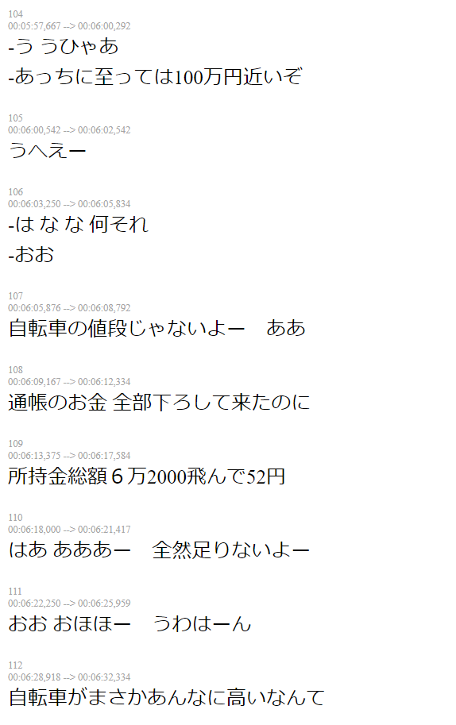

# SRT to HTML

Helps creating a HTML file with the SRT dialogs in text format

## Usage

```
ruby srt_to_html.rb <sub_file.srt>
```

Formats supported: SRT

Example of how formatted HTML looks:



### Arrows navigation

Use Left and Right arrow to navigate between dialogs

### Space key disabled

To avoid missclicks, space key default behaviour has been disabled
